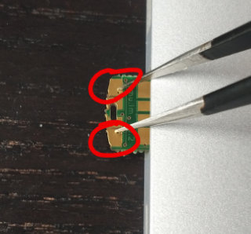

# Bootloader for [Tomu board](http://tomu.im)

This repo contains Toboot and associated support files for the [EFM32HG Tomu board](https://github.com/im-tomu/tomu-hardware).

Toboot is a DFU-based bootloader for Tomu that supports easy and driver-free firmware updates.

## Using Toboot

When you insert Tomu, Toboot runs by default.  Some programs (such as the u2f code) set the `TOBOOT_CONFIG_FLAG_AUTORUN` flag, and start running immediately.  To enter Toboot on these devices, short out the two outer pins with tweezers as you insert Tomu:



When Toboot runs, the lights will flash like this:


You should install dfu-util.  Linux users can find it in your package manager.  Mac users can use Homebrew.  The Windows binary is provided in the [bin/](./bin) directory.  Chrome users can use a [web version](https://devanlai.github.io/webdfu/dfu-util/) (but Linux users should make sure the udev permissions are set up correctly first.)

You can show a list of detected devices with `dfu-util --list`.  You can load a new program image with `dfu-util --download`.

## Toboot API

While Toboot supports jumping straight to code, it is also possible to take advantage of more advanced features such as secure sectors and automatic program booting.  This requires setting up a configuration struct located at the correct offset.

More information on the Toboot API is available in [API.md](API.md).

## Watchdog Timer

**Toboot Sets the Watchdog Timer**.  Your program **will** reboot if the watchdog timer isn't cleared within a few tens of milliseconds.  This is to ensure the code returns to the bootloader if you accidentally do something like flash an MP3 file, or try to program the .ihex version.

A quick-and-dirty way to do this is to put the following at the start of your program:

````c++
*(uint32_t *)0x40088000UL = 0;
````

Of course, it's better to actually use a Watchdog driver and keep the watchdog fed normally.  But this will at least get you going.

## Entering Toboot

**By default, Toboot will always run when a board is powered on**.  To automatically run your program at poweron, create a valid Toboot V2.0 header and set `TOBOOT_CONFIG_FLAG_AUTORUN`.  This was done to make it easy to develop software, because all you need to do to load new firmware is to unplug Tomu and plug it back in.

There are several reasons why a user might end up in Toboot:

1. The config value doesn't have `TOBOOT_CONFIG_FLAG_AUTORUN` set, and the board has just been powered on.
1. There is no main application loaded.  This can happen if you've erased the flash, or if you've loaded an invalid binary.  The program's start address must be in flash, and the stack pointer must be in RAM.
1. The board has failed to finish booting three times in a row.  This can happen if you've loaded an invalid program, or if you haven't cleared the watchdog timer.
1. The magic value `0x74624346` is stored in the boot token area, at RAM address 0x20000000.
1. The user shorts the two outer pads together when they apply power AND the program has NOT set TOBOOT_LOCKOUT_MAGIC.

## Installing or Upgrading Toboot

To install Toboot, use the `boosted` files in the [prebuilt/](./prebuilt) directory:

* **Toboot**: Use dfu-util to load [prebuilt/toboot-boosted.dfu](./prebuilt/toboot-boosted.dfu)
* **AN0042**: Use the serial bootloader to load [prebuilt/toboot-boosted.bin](./prebuilt/toboot-boosted.bin)

Toboot is unable to reflash itself.  This is to prevent partial updates from corrupting the firmware.  Instead, a support program is appended to the start of Toboot, and the entire thing is uploaded as one chunk.

## Building Toboot

Toboot is designed to be simple to build.  Ensure you have an ARM toolchain installed such as the [official one from ARM](https://developer.arm.com/open-source/gnu-toolchain/gnu-rm), as well as `make`.  Then simply build:

````sh
cd toboot/
make
````

## Creating Updates

Toboot is not allowed to overwrite intself, to prevent partial updates from making a board unusable.

The `Booster` program is used to update or install Toboot.  The source code is located in the [booster/](./booster) directory.  Use `make-booster` to wrap toboot.bin in a booster app, and flash the resulting image using dfu-util:

````sh
cd ../booster/
make
gcc make-booster.c -o make-booster
./make-booster ../toboot/toboot.bin toboot-booster.bin
cp toboot-booster.bin toboot-booster.dfu
dfu-suffix --pid 0x70b1 --vid 0x1209 --add toboot-booster.dfu
````

You can then flash the resulting `toboot-booster.dfu` using dfu-util, or using the legacy serial uploader to flash `toboot-booster.bin`:

`dfu-util -d 1209:70b1 -D toboot-booster.dfu`

## Flashing onto a new Tomu

Brand-new Tomus will not have Toboot installed.  Instead, they might have the SiLabs `AN0042` bootloader.  

The recommend way to load the bootloader onto a Tomu board is using a Raspberry Pi with
[OpenOCD](http://openocd.org/). Instructions for doing this can be found in the
[openocd](openocd) directory. You need OpenOCD **version 0.10.0 or later** to
have EFM32HG support.

Tomu can be powered using the 3.3V pin, so you can create a sort of "programming wand" by bringing 3.3V, GND, SCK, and SIO out to a 0.1" header, running openocd in a loop, and touching the programming pins on the side of a Tomu board.  The process only takes a few seconds, so contact doesn't have to be great.

## Legacy Bootloader

SiLabs AN0042 was the original bootloader.  It requires an IAR compiler to build, as well as custom drivers/software on the host device.  This bootloader is available in the 'an0042' branch, and has been removed from the master branch.  It is here for historical interest, and for compatibility with stock EFM32HG utilities.
